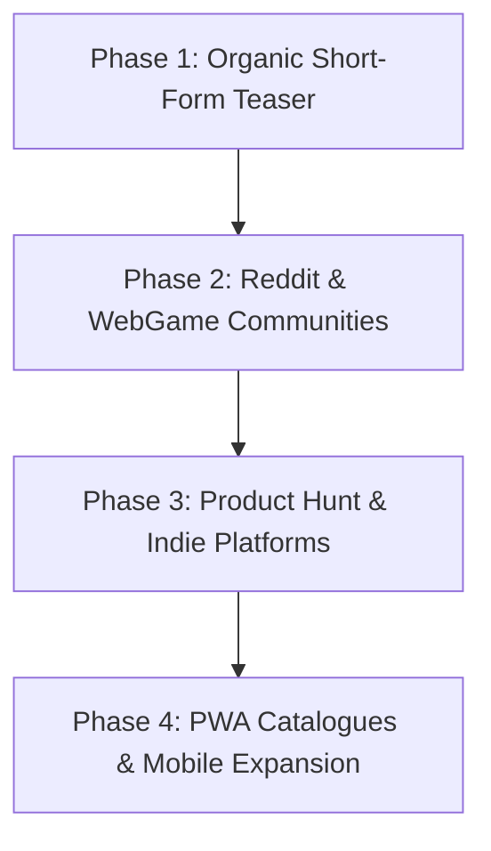

# SONAR: The Echo Chamber — Marketing- & Wachstums-Strategie

## 1. Executive Summary & Core Hook
**SONAR: The Echo Chamber** ist ein minimalistischer, audio-visueller 2D-Stealth-Thriller für Web und Mobile (PWA).  
*Core Hook:* **"Du bist in 4.000 Metern Tiefe gefangen. Es ist 100% stockdunkel. Du siehst nur, wenn du Schall machst... aber die Raubdrohnen hören dich auch."**

---

## 2. Zielgruppenanalyse (Target Audience)

### Primäre Zielgruppen:
1. **Sci-Fi & Claustrophobic Thriller Fans:**
   - Fans von Serien/Filmen wie *Dark*, *Alien*, *Silo*, *Underwater*, *The Abyss*, *A Quiet Place*.
   - Reiz: Dunkle, bedrohliche Tiefsee-Atmosphäre (*Operation Zero-Light*, havarierte Station *TETHYS-6*), High-Stakes-Atmosphäre.
2. **Tactical Puzzle & Stealth Enthusiasten:**
   - Spieler von *Metal Gear Solid (VR Missions)*, *Volume*, *Mark of the Ninja*, *Darkwood*, *Pac-Man (Horror Spin-offs)*.
   - Reiz: Präzise Pfadfindung (BFS AI), Köder-Taktiken (Decoy Flare), Schleichmechanik (Shift / Sneak Toggle), Rang-Bewertungen (S-Rank Speedruns).
3. **Hyper-Casual & Web Arcade Speedrunner:**
   - Plattformen: TikTok / Mobile Web Browser / Reddit WebGames / itch.io.
   - Reiz: Instant Play (kein Download, <1s Ladezeit, PWA Standalone), kompetitives globales Leaderboard mit 4-stelligem PIN-Cloud-Save.

---

## 3. Short-Form Video Hook Konzepte (TikTok, Instagram Reels, YouTube Shorts)

### Hook 1: "Der Blinde Schrecken" (High-CTR Curiosity Hook)
- **Visual:** Schwarzer Bildschirm. Plötzlich ein Schockwellen-Ping (`SPACE`), der für 1.5 Sekunden ein komplexes Labyrinth und zwei rot pulsierende Augen (`HUNTER`) direkt neben dem Spieler aufdeckt.
- **Audio:** Realistischer Tiefsee-Sonar-Ping gefolgt von einem dumpfen akustischen Alarm.
- **Text-Overlay:** *"Das Spiel, bei dem du nur siehst, wenn du Schall machst... aber die Monster hören dich auch."*
- **Call-to-Action:** *"Link in Bio: Kannst du Sektor 01 überleben?"*

### Hook 2: "Der Stalker-Trick" (Tactical Secret Hook)
- **Visual:** Ein violetter *Shadow Stalker* schleicht lautlos auf den Spieler zu. Spieler löst im letzten Moment einen Sonar-Ping aus – der Stalker erstarrt im Lichtblitz (2.5s Stun) und der Spieler entkommt durch die grüne Schleuse.
- **Text-Overlay:** *"99% der Spieler sterben hier, weil sie nicht wissen, dass Licht Stalker einfriert 😱"*
- **Audio:** Spannende Bass-Steigerung + Freeze-Soundeffekt.

### Hook 3: "Köder-Genie vs. Hunter" (Satisfying Outplay)
- **Visual:** Zwei Hunter blockieren den engen Gang zum letzten Resonanz-Datenkern. Spieler wirft einen akustischen Köder (`E`) 3 Blöcke nach links. Beide Hunter sprinten alarmiert zur Täuschung, während der Spieler lautlos im Schleichmodus vorbeischlüpft.
- **Text-Overlay:** *"IQ 300 Köder-Move in 4.000m Tiefe."*

### Hook 4: "Endless Echo: Etage 35+ Flex" (Challenge / Flex Hook)
- **Visual:** Schneller Zusammenschnitt aus tiefen Endless-Etagen mit massiven Resonator-Kettenreaktionen und Flucht in letzter Millisekunde.
- **Text-Overlay:** *"Niemand schafft Etage 30 im Endless Mode. Aktueller Weltrekord: Etage 42. Schaffst du mehr?"*

---

## 4. Virale Gameloop-Elemente & Retention-Treiber

1. **Instant Death & 1.5s Fatal Reveal:**
   - Beim Tod deckt eine rote Schockwelle die tödliche Wand oder den Jäger auf. Perfekt für reaktive "Fail-Clips" und Replays.
2. **Rang-System (S / A / B / C):**
   - Belohnt perfekte Stealth-Runs (0 unnötige Pings, schnellste Zeit). Spieler teilen Screenshots ihrer S-Rank-Abzeichen.
3. **Globales Cloud-Leaderboard:**
   - Live-Firestore-Ranking mit Rufzeichen (z.B. `PILOT // GHOST-9`) und sofortiger Vergleichbarkeit der bereinigten Sektoren.
4. **Endless Echo (Prozeduraler Roguelike Mode):**
   - Unendlicher Wiederspielwert durch zufällig generierte Labyrinthe mit steigender Bedrohungskurve.

---

## 5. Schritt-für-Schritt Launch- & Distributions-Roadmap

### Phase 1: Organische Teaser-Kampagne (Woche 1–2)
- Veröffentlichung von 10–15 variierten Video-Hooks auf TikTok, Instagram Reels und YouTube Shorts.
- Fokus auf Sounddesign (ASMR-Schritte, dumpfer Sonar-Ping, Jäger-Kreischen).
- Bio-Link direkt auf GitHub Pages: `https://bauerjohannes2-max.github.io/SONAR/`.

### Phase 2: Community-Launch (Woche 3)
- **Reddit:**
  - `r/WebGames`: *"I made a stealth game where you only see through sound waves, but enemies hear you too (Zero dependencies, pure Canvas 2D)"*.
  - `r/IndieGaming`: Gameplay-Clip des Köder-Mechanismus und der Akustik-Wellen.
  - `r/gamedev`: Post-Mortem über BFS-Pathfinding, Web Audio API Synthesizer und Zero-Light Rendering.
- **Hacker News (Show HN):**
  - *"Show HN: SONAR – Sound-based browser stealth thriller built with Vanilla JS & Web Audio API"*.

### Phase 3: Plattform-Listing & Portale (Woche 4)
- **Product Hunt Launch:**
  - Kompletter Showcase mit animierten GIFs, Trailer und Creator-Kommentar.
- **Web-Gaming Portale:**
  - Einreichung bei *itch.io* (HTML5 Web Playable), *CrazyGames*, *Newgrounds*.

### Phase 4: PWA-Distribution & Mobile Growth (Ongoing)
- Listing auf PWA-Verzeichnissen: *Appscope*, *FindPWA*, *Progressier*.
- Vollständiger Offline-Support via Service Worker (`sw.js`) und Instant-Launch im Landscape-Format ohne Klick-Barrieren.
