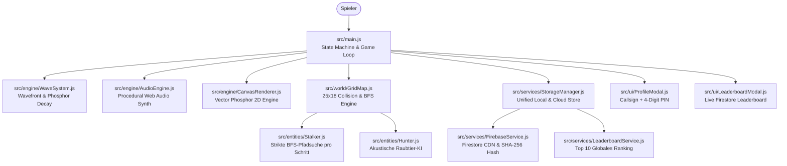

# SONAR: The Echo Chamber

> **Zero Light. Information = Death. Sicht existiert nur durch Schall.**
>
> 🌐 **Live Web-Version:** [https://bauerjohannes2-max.github.io/SONAR/](https://bauerjohannes2-max.github.io/SONAR/)

Ein gnadenloser 2D-Arcade-Stealth-Thriller auf HTML5 Canvas mit nativer Web Audio API Klangerzeugung, prozeduralem Raycasting, Cloud-Saves und globalem Firestore-Leaderboard.

---

## 🛰️ System-Architektur & Protokoll



---

## 🎮 Steuerung & Einsatz-Protokoll

| Taste / Eingabe | Aktion | Schall-Radius | Feind-Reaktion |
|---|---|---|---|
| **WASD** / **Pfeiltasten** | Schritt im 25x18 Raster (120ms) | 2.5 Kacheln (80px) | Alarmiert Hunter im Nahbereich |
| **Shift (halten)** / **[SNEAK]** | Schleichen (240ms) | 0 Kacheln (0 Schall) | Hunter bemerken dich nicht |
| **Leertaste (Space)** / **[PING]** | Großer Sonar-Ping (Global) | Ganzer Bildschirm | Alarmiert Hunter // Betäubt Stalker 2.5s |
| **E** / **[KÖDER]** | Schall-Köder werfen (1/Sektor) | 4 Kacheln Wurf | Sendet 3s Klick-Impulse, lockt Hunter an |
| **ESC** / **[PAUSE]** | Taktische Pause & Optionen | — | Pausiert das Spielgeschehen |
| **F** / **[ ⛶ ]** | Vollbildmodus umschalten | — | Skaliert pixelgenau (`pixelated`) |

*Auf Touchscreens (Smartphones & Tablets) wird automatisch ein virtuelles Cyberpunk D-Pad und Aktionsknöpfe eingeblendet.*

---

## 👤 Pilot-Profil & Cloud-Sync Protokoll

1. **Zero-Friction Gast-Modus:**
   - Standardmäßig speichert das Spiel sofort im `localStorage`. Jeder kann ohne Registrierung direkt losspielen.
2. **Pilot-Registrierung & Login (`[ 👤 PILOTEN-PROFIL ]`):**
   - **Callsign:** 3 bis 12 Zeichen (Buchstaben, Zahlen, `_`, `-`).
   - **Sicherheits-PIN:** 4 Ziffern.
   - **Kryptographie:** Client-seitiges Hashing mit `SHA-256` via Web Crypto API (`crypto.subtle.digest`). Es werden keine Klartext-PINs übertragen.
3. **Automatischer Cloud-Upload:**
   - Nach jedem Sektor-Abschluss und Game Over wird der höchste erreichte Spielstand (`unlockedSector`, `sectorStats`, `endlessHighscore`) live mit der Firestore-Collection `pilots` synchronisiert.

---

## 🏆 Globales Leaderboard Protokoll

- **Cloud-Live-Ranking (`[ 🏆 LEADERBOARD ]`):**
  - Lädt in Echtzeit die Top 10 Drohnen-Piloten aus Google Cloud Firestore sortiert nach höchstem Level und Endless-Highscore.
  - Spalten: `RANG` | `PILOT (NAME)` | `HÖCHSTES LEVEL` | `DATUM`.
  - Der eigene Pilot wird farblich hervorgehoben (`[ DU ]`).
- **Offline-Resilienz:**
  - Bei Netzwerkunterbrechung schaltet das Terminal nahtlos auf lokale Bestmarken um, ohne den Spielfluss zu unterbrechen.

---

## 👾 Feind- und Entitäts-Katalog

1. **Hunter (Rot - `Hunter.js`):**
   - Blinde akustische Jäger. Patrouillieren im Normalzustand. Sobald ein Geräusch (Schritt, Ping, Köder) in Hörweite registriert wird, sprinten sie via BFS-Wegfindung zum Ursprung.
2. **Shadow Stalker (Lila - `Stalker.js`):**
   - Lautlose Schatten-Prädatoren. Berechnen vor jedem Einzelschritt den mathematisch kürzesten BFS-Pfad zur Drohne.
   - Werden durch einen Sonar-Ping (`Space`) für 2.5 Sekunden im Lichtkegel betäubt (`STUNNED`).
3. **Resonatoren (Gelb - `Resonator.js`):**
   - Alarmbojen. Reagieren auf eintreffende Schallwellen, laden sich kurz auf und senden eine globale Schockwelle aus, die alle Hunter alarmiert.
4. **Lighthouses (Cyan - `Lighthouse.js`):**
   - Periodisch pulsierende Leuchtfeuer, die sichere Orientierungszonen aufdecken.
5. **Acoustic Decoy (`Decoy.js`):**
   - Werfbare Köderfackel, die über 3 Sekunden regelmäßige Schallimpulse emittiert, um Hunter wegzulocken.
6. **Airlock Extraktion (`Gate.js`):**
   - Schaltet frei, sobald alle Resonanz-Kristalle (`◆`) im Sektor geborgen wurden.

---

## 🕹️ Spielmodi

1. **Kampagne (Sektoren 01 - 10):**
   - 10 handgefertigte taktische Labyrinthe mit steigender Komplexität und neuen Feind-Kombinationen.
2. **Endless Echo (Prozedurales Roguelike):**
   - Unendliche, dynamisch generierte 25x18-Gitter mit dem Recursive-Backtracker-Algorithmus und prozedural platzierten Kristallen, Gefahren und Feinden.

---

## 💻 Lokale Entwicklung

```bash
# Entwicklungs-Server starten
npm run dev
# oder
python -m http.server 3004
```

Öffne **`http://localhost:3004`** im Browser.
